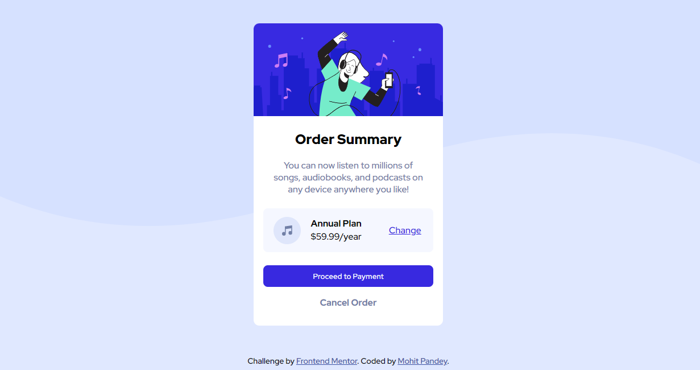

# Frontend Mentor - Order summary card solution

This is a solution to the [Order summary card challenge on Frontend Mentor](https://www.frontendmentor.io/challenges/order-summary-component-QlPmajDUj). Frontend Mentor challenges help you improve your coding skills by building realistic projects. 

## Table of contents

- [Overview](#overview)
  - [Screenshot](#screenshot)
  - [Links](#links)
- [My process](#my-process)
  - [Built with](#built-with)
  - [What I learned](#what-i-learned)
  - [Continued development](#continued-development)
  - [Useful resources](#useful-resources)
- [Author](#author)
- [Acknowledgments](#acknowledgments)


## Overview

Built a Order summary card layout using HTML & CSS to get the hang of it. I have tried to build it as close as possible to screenshot shared by Frontend Mentor.  

### Screenshot

**Desktop View**



**Mobile View**


### Links

- Solution URL: [https://www.frontendmentor.io/solutions/order-summary-card-HyTMlAdmq](https://www.frontendmentor.io/solutions/order-summary-card-HyTMlAdmq)
- Live Site URL: [https://mohit1397.github.io/Order-Summary-Card/](https://mohit1397.github.io/Order-Summary-Card/)

## My process

### Built with

- Semantic HTML5 markup
- CSS custom properties
- Flexbox


### What I learned

I was struggling with the background image as it repeated on both the axis while I needed to repeat it on just the x-axis. For that, we can use background-repeat: repeat-x and it will just repeat the x-axis.
Here's the code snippet for background-repeat which I have used

```css
body {
    background-image: url(images/pattern-background-desktop.svg);
    background-repeat: repeat-x;
    background-size: contain;
    background-color: hsl(225, 100%, 94%);
}

```

### Continued development

I want to try and apply different scripts once I have learned JS. 

### Useful resources

- [background-repeat](https://www.w3schools.com/cssref/pr_background-repeat.asp) - This property helped me to make background repetion in just x-axis.

## Author

- Website - [Mohit Pandey](https://mohit1397.github.io/resume/)
- Frontend Mentor - [@Mohit1397](https://www.frontendmentor.io/profile/Mohit1397)
- Twitter - [@mohitpandey1397](https://twitter.com/mohitpandey1397)
